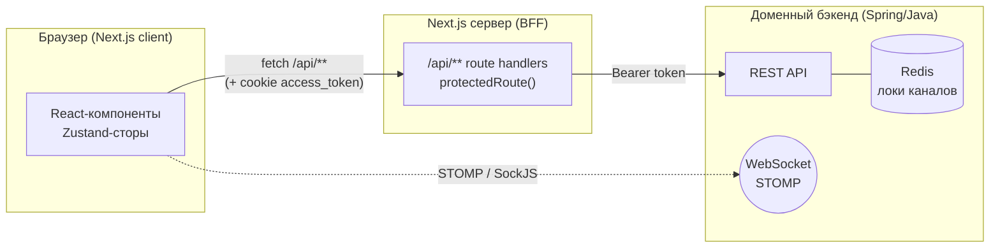

# SCADA Editor Frontend

Веб-редактор мнемосхем SCADA + база каналов (устройств и тегов) + просмотр логов.
Проект построен на **Next.js (App Router)** и выступает одновременно фронтендом и
**BFF-прослойкой** (Backend-for-Frontend): все обращения к доменному бэкенду идут через
внутренние роуты `/api/**`, которые проксируют запросы и подставляют авторизацию.

> Основной язык кодовой базы (комментарии, UI-тексты) — русский.

---

## Содержание

- [Возможности](#возможности)
- [Технологический стек](#технологический-стек)
- [Архитектура](#архитектура)
- [Структура проекта](#структура-проекта)
- [Быстрый старт](#быстрый-старт)
- [Переменные окружения](#переменные-окружения)
- [Скрипты](#скрипты)
- [Обзор API (BFF)](#обзор-api-bff)
- [Ключевые концепции редактора](#ключевые-концепции-редактора)
- [База каналов и блокировки](#база-каналов-и-блокировки)
- [Заметки для разработчиков](#заметки-для-разработчиков)

---

## Возможности

### 🖥️ Редактор мнемосхем (`/editor`)
- Холст на **Konva** (`react-konva`) с камерой: зум (Ctrl+колесо), панорамирование
  (колесо / Shift+колесо / средняя кнопка), рамка-выделение.
- Примитивы: линия, прямоугольник, круг, полигон, текст, чекбокс, прогресс-бар, path.
- Группировка, вложенные группы, «вход» в группу для редактирования её содержимого.
- **Логические компоненты**: группа примитивов промоутится в компонент («Создать
  компонент»), примитивы «запекаются» в изображение, а дерево показывает только
  логические сущности. Компоненты можно вкладывать друг в друга и разбирать обратно.
- **Состояния** элементов (например «Нормальное»/«Авария») с наложением визуальных
  свойств (overrides), распространяемых по поддереву по имени состояния.
- Привязка к сетке (grid = 20) при рисовании, перетаскивании, ресайзе, группировке.
- Проекты и сцены, импорт/экспорт, палитра сохранённых компонентов, свойства и теги.
- История изменений (undo/redo) через **zundo**.

### 🗄️ База каналов (`/channels`)
- Дерево устройств/каналов (**rc-tree**) с иерархией «площадка → проект → устройство → каналы».
- Просмотр и редактирование параметров устройства с черновиками в `localStorage`.
- **Блокировки редактирования** через Redis на бэкенде: при входе в режим правки
  узлы лочатся, чтобы их не редактировал другой пользователь одновременно; локи
  снимаются при завершении, SPA-навигации и **выгрузке страницы** (см. ниже).
- Мультивыбор площадок/проектов, живые обновления по WebSocket (STOMP/SockJS).

### 📜 Логи (`/log`)
- Просмотр логов системы.

### 🔐 Аутентификация
- Вход/регистрация (`/login`, `/register`), httpOnly-cookie `access_token`.

---

## Технологический стек

| Слой | Технологии |
|------|-----------|
| Framework | **Next.js 16** (App Router, Turbopack), **React 19** |
| Язык | **TypeScript 5** (strict) |
| Стили | **Tailwind CSS 4**, `next-themes` (светлая/тёмная тема), Radix UI, `tw-animate-css` |
| Состояние | **Zustand 5** (+ **zundo** для undo/redo), TanStack Query |
| Холст | **Konva 10** / `react-konva`, `react-rnd` |
| Формы / валидация | `react-hook-form`, `zod` |
| Дерево / DnD | `rc-tree`, `@dnd-kit/core` |
| Редактор кода | `@uiw/react-codemirror` (JS/Java) |
| Реалтайм | `@stomp/stompjs` + `sockjs-client` |
| UI-утилиты | `lucide-react`, `sonner` (тосты), `clsx`, `tailwind-merge`, `framer-motion` |
| Тулинг | ESLint 9, Prettier, Husky + lint-staged |

---

## Архитектура

Приложение — фронтенд **и** BFF. Клиентский код не ходит в доменный бэкенд напрямую:
он обращается к внутренним роутам `/api/**`, а те проксируют запрос к бэкенду,
добавляя `Authorization: Bearer <token>` из cookie.



**Аутентификация.** `POST /api/auth/login` вызывает бэкенд и кладёт токен в httpOnly-cookie
`access_token` (`src/lib/setTokenCookies.ts`). Все защищённые роуты обёрнуты в
`protectedRoute` (`src/lib/protected.ts`): он читает cookie и пробрасывает Bearer-токен;
без токена — `401`.

**Домены.** Три независимые области с собственными сторами:
`editor` (`useEditorStore` + `usePaletteStore`), `channels` (`useDeviceStore`),
`logs` (`useLogsStore`). Модалки — через `modalStore` + `ModalRoot`.

---

## Структура проекта

```
src/
├── app/                        # App Router: страницы + API-роуты
│   ├── page.tsx                # Главная
│   ├── editor/                 # Редактор мнемосхем (Canvas, палитра, свойства)
│   ├── channels/               # База каналов (дерево, параметры, поиск)
│   ├── log/                    # Логи
│   ├── login/ · register/      # Аутентификация
│   └── api/                    # BFF: прокси к бэкенду (см. «Обзор API»)
│
├── components/
│   ├── editor/
│   │   ├── Canvas.tsx          # Тонкий оркестратор холста (~200 строк)
│   │   └── canvas/             # Рендер: shapes/*, hooks/*, types, контекст рендера
│   ├── channels/               # DeviceTreePanel, DeviceParams, StartMenu, …
│   ├── ui/                     # Общие UI-компоненты и модалки
│   └── logs/
│
├── store/                      # Zustand-сторы (editor, device, palette, logs, modal)
├── lib/                        # Чистые хелперы (в т.ч. lib/editor/*), protected, auth
├── constants/                  # elementRegistry, propertiesPanel, contextMenuItems
├── types/                      # Типы (editorElement.type, nodeTypes, …)
├── providers/                  # WebSocketProvider
└── shared/websocket/           # STOMP-клиент и подписки
```

Наиболее важные для понимания файлы редактора:
`src/types/editorElement.type.ts`, `src/store/useEditorStore.ts`,
`src/lib/buildComponentTree.ts` ↔ `src/lib/transformElements.ts`,
`src/components/editor/canvas/`.

---

## Быстрый старт

### Требования
- **Node.js 20+**
- Запущенный доменный бэкенд (по умолчанию `http://localhost:8080`) с Redis.

### Установка и запуск

```bash
# 1. Установить зависимости
npm install

# 2. Создать .env.local из примера (см. раздел ниже)
cp .env.example .env.local

# 3. Запустить dev-сервер (Turbopack)
npm run dev
```

Приложение будет доступно на **http://localhost:3000**.

Продакшн-сборка:

```bash
npm run build
npm run start
```

---

## Переменные окружения

Задаются в `.env.local` (не коммитится).

| Переменная | Назначение | По умолчанию |
|------------|-----------|--------------|
| `BACKEND_URL` | Базовый URL бэкенда для доменных API (устройства, каналы, логи, auth, lock/unlock) | `http://localhost:8080` |
| `BACKEND_URL_EDITOR` | Базовый URL бэкенда для API редактора (сцены, компоненты, проекты, теги, палитра) | `http://localhost:8080` |

Пример `.env.local`:

```env
BACKEND_URL=http://localhost:8080
BACKEND_URL_EDITOR=http://localhost:8080
```

---

## Скрипты

| Команда | Действие |
|---------|----------|
| `npm run dev` | Dev-сервер (Turbopack) на `:3000` |
| `npm run build` | Продакшн-сборка |
| `npm run start` | Запуск собранного приложения |
| `npm run lint` | ESLint |

Перед коммитом **Husky + lint-staged** прогоняют `eslint --fix` и `prettier --write`
по staged-файлам `*.{js,ts,tsx}`.

---


## Заметки для разработчиков

- **`tsc`/`next build`**: в кодовой базе есть стабильный набор пред­существующих
  ошибок типов (в частности, объединение `ElementType` неполно), из-за чего строгий
  `tsc`/`next build` «красные». Разработка идёт через `next dev`, который допускает
  ошибки типов. При правках ориентируйтесь на то, чтобы **не добавлять новые** ошибки
  сверх текущего baseline, а не на «зелёный» `tsc».
- Комментарии и UI-тексты — на русском; придерживайтесь того же в коде домена.
- Иерархия «Проект → Сцена → Элементы» защищена проверками принадлежности
  (`sceneBelongsToCurrentProject`) — не убирайте эти guard-ы.
- Тестового раннера в проекте нет.

---

<sub>Проект развивается; структура и API могут меняться.</sub>
